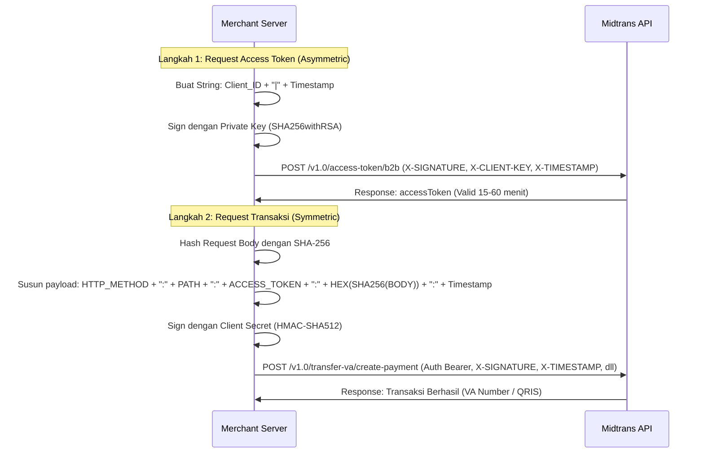

# Dokumentasi Integrasi & Konfigurasi Payment BI SNAP Midtrans

Dokumen ini mencatat langkah-langkah pembuatan Merchant Public/Private Key, konfigurasi di Dashboard Midtrans, serta alur penggunaan/pembuatan signature untuk API BI SNAP (Standar Nasional Open API Pembayaran).

---

## 1. Pembuatan Merchant Public & Private Key (RSA 2048-bit)

Untuk otentikasi asimetris BI SNAP, kita memerlukan key pair RSA 2048-bit. Berikut adalah perintah OpenSSL yang telah dijalankan untuk men-generate key tersebut:

1. **Membuat Private Key asli (PKCS#1):**
   ```bash
   openssl genrsa -out private-key.pem 2048
   ```

2. **Mengonversi Private Key ke format PKCS#8 (Direkomendasikan untuk Node.js & framework backend lainnya):**
   ```bash
   openssl pkcs8 -topk8 -inform PEM -outform PEM -nocrypt -in private-key.pem -out private-key-pkcs8.pem
   ```
   *Simpan file `private-key-pkcs8.pem` di server Anda dengan aman dan jangan pernah di-commit ke public repository.*

3. **Mengekstrak Public Key dari Private Key:**
   ```bash
   openssl rsa -in private-key.pem -pubout -out public-key.pem
   ```
   *File `public-key.pem` ini yang diunggah ke dashboard Midtrans.*

---

## 2. Kredensial & Konfigurasi Dashboard Midtrans

Berdasarkan konfigurasi yang dibuat pada **02 Juni 2026**, berikut adalah detail kredensial Sandbox / Production yang dihasilkan:

* **Merchant Public Key (Telah diunggah ke dashboard):**
  ```pem
  -----BEGIN PUBLIC KEY-----
  MIIBIjANBgkqhkiG9w0BAQEFAAOCAQ8AMIIBCgKCAQEAzJR2OV66qPWZjSMiRKvta6MAoA
  O/XpOiySVJyftpwtplWBL5BZ2blNHvP+NuXzPMjMOYieyZS5dBkDz973wM7GnZ/q+tzYhtDQd
  6pPcZTLKHy/rx6RZOTvj9fjb+hjAdS8PsZEneqij2dGMX2Q06KECvoBvyIQV+AMFX81FdIH2vzb
  vaN6Qs5uGfNGDklfrQVS7jvrX7KDA1mYpObxL9ZTaN+tUfm+HhFFg83ubWm6kecHgj3KEL5ft
  21RTbzRNXqO0/aEfQqHXBIR6DzFzWQ0geZNX0elelK6/pcpDHoOGLOYQjSfEL10Xis2XCbu90
  ImQkFYBZkr9ixxmztjJH4QIDAQAB
  -----END PUBLIC KEY-----
  ```
* **Client ID:** `cZskzETq-M618440929-SNAP`
* **Client Secret:** `DbUhvJQ48oi6S8mD61RQQ4dYy6XyACzR3kuGnTM2cVsryjmRd4GEPlyTpTdIdYX4ml2CAOjupHtcDIoQXeg2OxHPFE8sAvVih3n30IPJJxC8v9X3H1fi5v38Pv5PGbqu`
* **IP Whitelist:** Pastikan IP Address server backend Anda telah didaftarkan pada kolom IP Whitelist di menu konfigurasi BI SNAP dashboard Midtrans.

---

## 3. Alur Penggunaan & Otentikasi API BI SNAP

BI SNAP menggunakan **Two-Way Security Mechanism**:
1. **Asymmetric Signature (SHA256withRSA)** untuk mendapatkan B2B Access Token.
2. **Symmetric Signature (HMAC-SHA512)** untuk melakukan transaksi menggunakan B2B Access Token.



---

## 4. Contoh Implementasi Otentikasi dalam Node.js (TypeScript)

Berikut contoh fungsi untuk mengimplementasikan otentikasi BI SNAP:

### A. Mendapatkan B2B Access Token (Asymmetric Signature)

```typescript
import crypto from 'crypto';
import fs from 'fs';
import axios from 'axios';

interface AccessTokenResponse {
  accessToken: string;
  tokenType: string;
  expiresIn: string; // detik
}

async function getB2BAccessToken(): Promise<string> {
  const url = 'https://api.sandbox.midtrans.com/v1.0/access-token/b2b';
  const clientId = 'cZskzETq-M618440929-SNAP';
  const timestamp = new Date().toISOString(); // Format: YYYY-MM-DDTHH:mm:ss.SSSZ
  
  // 1. Baca Private Key PKCS#8
  const privateKeyPem = fs.readFileSync('./private-key-pkcs8.pem', 'utf8');

  // 2. Buat data to be signed: ClientID|Timestamp
  const dataToSign = `${clientId}|${timestamp}`;

  // 3. Generate Asymmetric Signature (SHA256withRSA)
  const sign = crypto.createSign('SHA256');
  sign.update(dataToSign);
  const signature = sign.sign(privateKeyPem, 'base64');

  // 4. Kirim Request
  const response = await axios.post<AccessTokenResponse>(url, {
    grantType: 'client_credentials'
  }, {
    headers: {
      'Content-Type': 'application/json',
      'X-CLIENT-KEY': clientId,
      'X-TIMESTAMP': timestamp,
      'X-SIGNATURE': signature
    }
  });

  return response.data.accessToken;
}
```

### B. Membuat Transaksi VA / Lainnya (Symmetric Signature)

```typescript
import crypto from 'crypto';
import axios from 'axios';

interface CreateVaPayload {
  partnerServiceId: string;
  customerNo: string;
  virtualAccountNo: string;
  virtualAccountName: string;
  trxId: string;
  totalAmount: {
    value: string;
    currency: string;
  };
}

async function createVaPayment(accessToken: string, payload: CreateVaPayload) {
  const urlPath = '/v1.0/transfer-va/create-payment';
  const fullUrl = `https://api.sandbox.midtrans.com${urlPath}`;
  const clientSecret = 'DbUhvJQ48oi6S8mD61RQQ4dYy6XyACzR3kuGnTM2cVsryjmRd4GEPlyTpTdIdYX4ml2CAOjupHtcDIoQXeg2OxHPFE8sAvVih3n30IPJJxC8v9X3H1fi5v38Pv5PGbqu';
  const timestamp = new Date().toISOString();
  
  const httpMethod = 'POST';
  
  // 1. Hash Request Body dengan SHA-256 (format Hex lowercase)
  const requestBodyString = JSON.stringify(payload);
  const bodyHash = crypto.createHash('sha256').update(requestBodyString).digest('hex').toLowerCase();

  // 2. Susun string untuk signature
  // Format: HTTPMethod:RelativeUrlPath:AccessToken:BodyHashHex:Timestamp
  const stringToSign = `${httpMethod}:${urlPath}:${accessToken}:${bodyHash}:${timestamp}`;

  // 3. Generate Symmetric Signature (HMAC-SHA512) menggunakan Client Secret
  const signature = crypto
    .createHmac('sha512', clientSecret)
    .update(stringToSign)
    .digest('base64');

  // 4. Kirim Request Transaksi
  const response = await axios.post(fullUrl, payload, {
    headers: {
      'Content-Type': 'application/json',
      'Authorization': `Bearer ${accessToken}`,
      'X-TIMESTAMP': timestamp,
      'X-SIGNATURE': signature,
      'X-PARTNER-ID': 'cZskzETq-M618440929-SNAP', // Biasanya sama dengan Client ID
      'X-EXTERNAL-ID': payload.trxId, // ID transaksi unik dari server Anda
    }
  });

  return response.data;
}
```

---

## 5. Rekomendasi Pengelolaan Credentials di `.env`

Tambahkan variabel berikut pada file `.env` project Anda untuk menyimpan kredensial di atas:

```env
# Midtrans BI SNAP Credentials
MIDTRANS_BI_SNAP_CLIENT_ID="cZskzETq-M618440929-SNAP"
MIDTRANS_BI_SNAP_CLIENT_SECRET="DbUhvJQ48oi6S8mD61RQQ4dYy6XyACzR3kuGnTM2cVsryjmRd4GEPlyTpTdIdYX4ml2CAOjupHtcDIoQXeg2OxHPFE8sAvVih3n30IPJJxC8v9X3H1fi5v38Pv5PGbqu"
MIDTRANS_BI_SNAP_PRIVATE_KEY_PATH="./private-key-pkcs8.pem"
```
