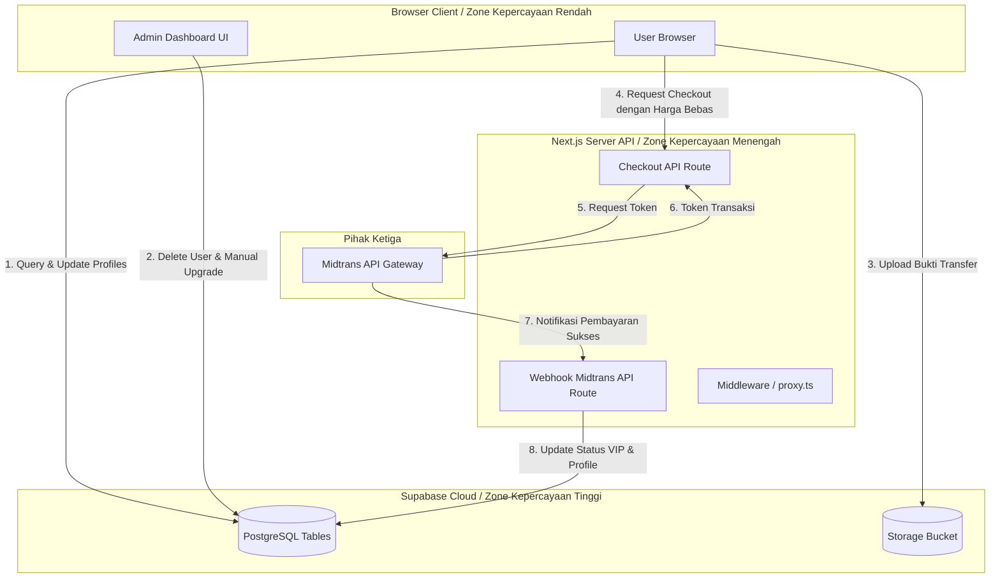

# 🛡️ Security Deep Dive Analysis — Imperium Crypto

Laporan ini menyajikan analisis keamanan mendalam (Security Audit) terhadap codebase **Imperium Crypto** di `/media/rasyiqi/PROJECT/imperium`. Fokus analisis mencakup mekanisme otentikasi, otorisasi, interaksi database Supabase, integrasi payment gateway Midtrans, manajemen file upload, serta konfigurasi routing proteksi.

---

## 🗺️ Threat Model & Data Flow

Meskipun aplikasi menggunakan Next.js di frontend, arsitektur saat ini sangat bergantung pada komunikasi langsung antara browser client dengan database Supabase menggunakan **Anon Key** publik. Di bawah ini adalah visualisasi aliran data dan batas kepercayaan (*trust boundaries*):



> [!CAUTION]
> **Trust Boundary Bypass**: Hampir seluruh logika administratif dan manipulasi status VIP dilakukan langsung dari **Browser Client** menuju **Supabase Database** tanpa melalui perantara server Next.js yang aman. Jika Row Level Security (RLS) di Supabase dinonaktifkan atau dikonfigurasi terlalu longgar, penyerang dapat memanipulasi seluruh isi database.

---

## 🔍 Temuan Kerentanan Utama (Vulnerabilities)

### 🔴 VULN-01: Bypass Otorisasi Admin via Client-side Database Operations (Anon Key)
* **Severity**: CRITICAL (9.8 / 10 - CVSS v3.1)
* **Dampak**: Kebocoran data pribadi pendaftar (*data leak*), penghapusan massal akun user (*data loss*), dan bypass aktivasi VIP secara gratis.
* **Analisis Kode**:
  Di file admin panel (seperti [members/page.tsx](file:///media/rasyiqi/PROJECT/imperium/app/(admin)/admin-panel/members/page.tsx#L55-L98) dan [payments/page.tsx](file:///media/rasyiqi/PROJECT/imperium/app/(admin)/admin-panel/payments/page.tsx#L50-L75)), operasi sensitif seperti `delete` user, `update` status plan menjadi VIP, dan `insert` data VIP dilakukan langsung melalui client browser menggunakan instance `supabase` yang diinisialisasi dengan Anon Key:
  ```typescript
  // app/(admin)/admin-panel/members/page.tsx
  const { error } = await supabase.from('profiles').delete().in('id', ids);
  
  // app/(admin)/admin-panel/payments/page.tsx
  await supabase.from('profiles').update({ plan: 'vip', plan_status: 'vip' }).eq('id', pay.id_user_auth);
  ```
  Siapa saja yang memiliki akses ke halaman web dapat membuka Developer Tools (F12) dan menjalankan perintah berikut di console untuk menghapus user lain atau mengubah status akunnya sendiri:
  ```javascript
  // Eksploitasi: Upgrade akun sendiri ke VIP secara ilegal lewat browser console
  await supabase.from('profiles').update({ plan: 'vip' }).eq('id', 'ID_ANDA');
  ```
* **Remediation**:
  1. Pindahkan semua aksi penulisan administratif (`insert`, `update`, `delete` pada tabel sensitif) ke **Next.js Server Actions** atau **API Routes** (misalnya `/api/admin/members/delete`).
  2. Di server, lakukan verifikasi sesi user yang meminta perubahan untuk memastikan mereka memiliki role `admin`.
  3. Gunakan `supabaseServer` (menggunakan `SUPABASE_SERVICE_ROLE_KEY`) *hanya* pada sisi server setelah otentikasi admin tervalidasi.

---

### 🔴 VULN-02: Privilege Escalation via User Plan Manipulation
* **Severity**: CRITICAL (9.0 / 10 - CVSS v3.1)
* **Dampak**: User biasa dapat menaikkan hak akses mereka sendiri menjadi `admin` untuk menguasai Admin Panel.
* **Analisis Kode**:
  File [proxy.ts](file:///media/rasyiqi/PROJECT/imperium/proxy.ts#L69-L82) (yang bertindak sebagai routing guard/middleware) melakukan validasi akses admin dengan membaca kolom `plan` pada tabel `profiles` di Supabase:
  ```typescript
  // proxy.ts
  const { data: profile } = await supabase.from('profiles').select('plan').eq('id', user.id).single()
  const userPlan = profile ? (profile as { plan: string | null }).plan : null
  if (userPlan !== 'admin') {
    return NextResponse.redirect(new URL('/dashboard', request.url))
  }
  ```
  Apabila RLS pada tabel `profiles` memperbolehkan user untuk melakukan `update` pada data mereka sendiri secara bebas, penyerang cukup mengubah kolom `plan` mereka menjadi `'admin'` lewat API client:
  ```javascript
  // Eksploitasi: Eskalasi hak akses menjadi Admin
  await supabase.from('profiles').update({ plan: 'admin' }).eq('id', 'MY_USER_ID');
  ```
  Setelah data di-update, middleware `proxy.ts` akan menganggap user tersebut adalah admin resmi dan mengizinkan mereka masuk ke `/admin-panel`.
* **Remediation**:
  Buat kebijakan **RLS Supabase** yang ketat pada tabel `profiles`. User hanya boleh mengubah kolom seperti `full_name` dan `whatsapp_number`, namun kolom `plan` dan `plan_status` hanya boleh diubah oleh sistem server menggunakan `service_role` (atau lewat DB trigger khusus).
  *Draf Kebijakan RLS SQL:*
  ```sql
  -- Izinkan semua user membaca profile mereka sendiri
  CREATE POLICY "User can read own profile" ON public.profiles 
    FOR SELECT USING (auth.uid() = id);

  -- Batasi update: user tidak boleh mengubah kolom 'plan'
  -- Cara terbaik: Pisahkan tabel otorisasi, atau buat trigger/policy yang menolak update plan dari public role
  CREATE POLICY "User can update own profile details except plan" ON public.profiles 
    FOR UPDATE USING (auth.uid() = id) 
    WITH CHECK (
      plan = (SELECT plan FROM public.profiles WHERE id = auth.uid()) -- Mencegah perubahan kolom plan
    );
  ```

---

### 🔴 VULN-03: Webhook Midtrans Tanpa Verifikasi Signature & Replay Attacks
* **Severity**: CRITICAL (8.8 / 10 - CVSS v3.1)
* **Dampak**: Pemalsuan status transaksi untuk mengaktifkan VIP secara gratis tanpa bayar sama sekali.
* **Analisis Kode**:
  Dalam endpoint [webhook/midtrans/route.ts](file:///media/rasyiqi/PROJECT/imperium/app/api/webhook/midtrans/route.ts#L11-L42), sistem menerima payload notifikasi dari Midtrans, mengekstrak `transaction_id`, lalu menanyakan langsung status transaksinya ke API Midtrans:
  ```typescript
  const data = await request.json();
  const transactionId = data.transaction_id as string;
  ...
  const statusResponse = await core.transaction.status(transactionId) as MidtransStatus;
  const { transaction_status, custom_field1 } = statusResponse;
  ```
  Walaupun sistem melakukan pengecekan balik (*pull validation*) ke API Midtrans, terdapat beberapa celah:
  1. **Replay Attack**: Penyerang bisa mengirim ulang payload notifikasi yang sah yang pernah dilakukan di masa lalu dengan memanggil URL `/api/webhook/midtrans` berulang kali. Jika user id target diganti di client/payload, sistem bisa terkecoh (bergantung pada `custom_field1` dari transaksi tersebut).
  2. **Inkonsistensi Sandbox vs Production**: Instance Midtrans `CoreApi` di webhook dideklarasikan dengan `isProduction: false` (Sandbox), sementara checkout menggunakan `isProduction: true`. Di lingkungan production, query ke endpoint sandbox untuk transaksi asli akan gagal/error, sehingga pembayaran asli tidak akan pernah terverifikasi.
* **Remediation**:
  Verifikasi signature key resmi yang dikirimkan oleh Midtrans di payload notifikasi. Midtrans mengirimkan SHA512 signature key yang dihitung berdasarkan:
  `signature_key = SHA512(order_id + status_code + gross_amount + ServerKey)`
  *Contoh Implementasi Verifikasi Signature:*
  ```typescript
  import { createHash } from 'crypto';

  // Di dalam POST handler webhook:
  const { order_id, status_code, gross_amount, signature_key } = data;
  const serverKey = process.env.MIDTRANS_SERVER_KEY || '';
  
  // Hitung hash pembanding
  const payloadString = order_id + status_code + gross_amount + serverKey;
  const calculatedSignature = createHash('sha512').update(payloadString).digest('hex');

  if (signature_key !== calculatedSignature) {
    return NextResponse.json({ error: 'Invalid Signature Key' }, { status: 403 });
  }
  ```

---

### 🟠 VULN-04: API Route Checkout - Manipulasi Harga & Spoofing ID
* **Severity**: HIGH (8.5 / 10 - CVSS v3.1)
* **Dampak**: User memesan VIP dengan harga murah (misal Rp 1) dan sistem otomatis memproses pembayaran tersebut karena harga tidak dicross-check dengan database.
* **Analisis Kode**:
  Endpoint [checkout/route.ts](file:///media/rasyiqi/PROJECT/imperium/app/api/checkout/route.ts#L6-L35) menerima parameter transaksi mentah dari request body client:
  ```typescript
  const { userId, email, nama, harga, paket } = await request.json();
  ...
  const parameter = {
    transaction_details: {
      order_id: `IMP-${Date.now()}`, 
      gross_amount: harga, // Dipercaya langsung dari input client!
    },
    custom_field1: userId,
    ...
  }
  ```
  Seorang penyerang bisa mengirim POST request buatan sendiri ke `/api/checkout` dengan body:
  ```json
  {
    "userId": "ID_PENYERANG",
    "email": "attacker@gmail.com",
    "nama": "Attacker",
    "harga": 1, 
    "paket": "Paket VIP 1 Tahun"
  }
  ```
  Midtrans akan menghasilkan token transaksi untuk Rp 1. Penyerang membayar Rp 1 melalui payment gateway, lalu Midtrans mengirim webhook sukses ke backend kita. Backend kemudian membaca nama paket dan status sukses dari Midtrans, lalu memberikan status VIP penuh kepada `userId` penyerang.
* **Remediation**:
  1. Jangan pernah mempercayai parameter harga (`harga`) yang dikirim langsung oleh client browser.
  2. Kirim parameter `paketId` dari frontend, lalu lakukan query harga resmi paket tersebut langsung dari database `data_paket_vip` di sisi server Next.js.
  3. Lakukan verifikasi token JWT Supabase untuk mengonfirmasi bahwa `userId` yang dikirim adalah milik user yang sedang login saat ini (jangan terima `userId` mentah dari body request).

---

### 🟠 VULN-05: Unrestricted File Upload pada Storage Bucket "pembayaran"
* **Severity**: HIGH (7.5 / 10 - CVSS v3.1)
* **Dampak**: Penyerang mengunggah file HTML/SVG berbahaya untuk serangan Cross-Site Scripting (XSS), script PHP/shell jika storage disinkronkan ke server lokal, atau mengunggah file raksasa untuk menghabiskan ruang penyimpanan (*storage depletion*).
* **Analisis Kode**:
  Pada komponen [confirm/page.tsx](file:///media/rasyiqi/PROJECT/imperium/app/(user)/dashboard/upgrade/confirm/page.tsx#L60-L95), upload bukti transfer dilakukan langsung dari client menuju bucket `pembayaran` di Supabase Storage:
  ```typescript
  const { error: upErr } = await supabase.storage.from('pembayaran').upload(fileName, file)
  ```
  Di browser, input file dibatasi dengan `accept="image/*"`, namun pembatasan ini sangat mudah dilewati dengan script manual atau postman. File berbahaya berupa `.html`, `.svg` (yang memuat script javascript), atau executable bisa terunggah dan diakses secara bebas melalui URL publik Supabase CDN.
* **Remediation**:
  1. Batasi ukuran file maksimum (maksimal 5MB) dan jenis mime-type (hanya `image/jpeg` atau `image/png`) langsung di pengaturan bucket Supabase.
  2. Implementasikan Row Level Security (RLS) di bucket Supabase Storage agar user hanya bisa mengunggah ke folder berlabel ID mereka sendiri (misal `pembayaran/user-id/bukti.png`).
  *Kebijakan RLS SQL Storage:*
  ```sql
  -- Izinkan user yang terotentikasi mengunggah file gambar dengan ukuran terbatas
  CREATE POLICY "Upload bukti transfer terbatas" ON storage.objects 
    FOR INSERT 
    TO authenticated 
    WITH CHECK (
      bucket_id = 'pembayaran' AND 
      (storage.foldername(name))[1] = auth.uid()::text AND
      (LOWER(storage.extension(name)) = 'jpg' OR LOWER(storage.extension(name)) = 'jpeg' OR LOWER(storage.extension(name)) = 'png')
    );
  ```

---

### 🟡 VULN-06: Kebocoran Server Key Midtrans via Application Logs
* **Severity**: MEDIUM (5.3 / 10 - CVSS v3.1)
* **Dampak**: Kebocoran potongan API Key rahasia ke console log cloud provider / logging server.
* **Analisis Kode**:
  Dalam file [checkout/route.ts](file:///media/rasyiqi/PROJECT/imperium/app/api/checkout/route.ts#L7):
  ```typescript
  console.log("DEBUG_KEY:", process.env.MIDTRANS_SERVER_KEY?.substring(0, 7) + "...");
  ```
  Mencetak sebagian kunci rahasia (*secret key*) ke server log. Meskipun hanya substring awal, informasi ini mempersempit ruang brute-force kunci dan melanggar prinsip kebersihan penulisan kredensial (*credential hygiene*).
* **Remediation**:
  Hapus baris `console.log("DEBUG_KEY", ...)` ini sepenuhnya dari codebase. Gunakan environment variable logger yang aman atau debugging lokal jika diperlukan.

---

### 🟡 VULN-07: Potensi Bypass Proteksi Route (Next.js Middleware Convention)
* **Severity**: MEDIUM (4.8 / 10 - CVSS v3.1)
* **Dampak**: Seluruh route admin (`/admin-panel/*`) dan dashboard user (`/dashboard/*`) dapat diakses tanpa login jika bundler/server mengabaikan file non-standard.
* **Analisis Kode**:
  File otorisasi dan proteksi route diletakkan di file bernama [proxy.ts](file:///media/rasyiqi/PROJECT/imperium/proxy.ts).
  Dalam standar framework Next.js, file middleware harus dinamai secara persis **`middleware.ts`** atau **`middleware.js`** di root direktori atau di dalam folder `src/`. Next.js *tidak secara otomatis mengeksekusi* file bernama `proxy.ts` sebagai middleware aplikasi kecuali terdapat konfigurasi reverse proxy khusus (seperti Nginx atau cloud proxy) di luar aplikasi Next.js.
  Jika Next.js dijalankan secara default (misalnya `npm run dev` atau `next start` di hosting standar), file `proxy.ts` akan diabaikan dan seluruh rute sensitif akan terbuka lebar untuk dikunjungi tanpa otentikasi.
* **Remediation**:
  Rename file `proxy.ts` menjadi `middleware.ts` untuk memastikan Next.js secara native memproteksi seluruh rute di sisi server sebelum me-render halaman.

---

## 📊 Matriks Risiko Keamanan (Risk Matrix)

| Kerentanan | Tingkat Bahaya (Severity) | Kemudahan Eksploitasi (Exploitability) | Dampak Bisnis / Aplikasi | Status Prioritas |
| :--- | :---: | :---: | :--- | :---: |
| **VULN-01: Admin Bypass via Client DB** | 🔴 Critical | Sangat Mudah (Console) | Penghapusan user, manipulasi data transaksi | **Paling Tinggi (1)** |
| **VULN-02: Privilege Escalation Plan** | 🔴 Critical | Sangat Mudah (Console) | Pengambilalihan hak akses Admin Panel | **Tinggi (2)** |
| **VULN-03: Webhook Midtrans Bypass** | 🔴 Critical | Menengah (Replay/Spoof) | Kehilangan omzet (VIP gratis tanpa bayar) | **Tinggi (3)** |
| **VULN-04: Checkout Price Manipulation**| 🟠 High | Mudah (Manipulasi Body JSON) | Kerugian finansial (VIP seharga Rp 1) | **Menengah (4)** |
| **VULN-05: Unrestricted File Upload** | 🟠 High | Menengah (Bypass Client Ext) | Serangan XSS, kehabisan ruang disk | **Menengah (5)** |
| **VULN-06: Credential Logging** | 🟡 Medium | Sulit (Perlu akses Log Server)| Kebocoran kredensial rahasia | **Rendah (6)** |
| **VULN-07: Custom Middleware Bypass** | 🟡 Medium | Mudah (Jika Nginx tidak ada) | Bypass akses seluruh halaman dashboard | **Rendah (7)** |

---

## 🛠️ Rencana Aksi Perbaikan (Remediation Roadmap)

Langkah perbaikan direkomendasikan dibagi menjadi tiga fase:

### Fase 1: Perbaikan Darurat (*Quick Wins / Hotfixes*)
1. **Verifikasi Webhook**: Tambahkan verifikasi `signature_key` menggunakan SHA512 di endpoint webhook Midtrans.
2. **Hapus Log Kredensial**: Hapus baris debug log `MIDTRANS_SERVER_KEY` di checkout route.
3. **Konfirmasi Middleware**: Jika deploy di Vercel atau environment Next.js standar, segera ubah nama `proxy.ts` menjadi `middleware.ts`.

### Fase 2: Pengamanan API & Database (*Backend Security*)
1. **Migrasi Operasi Admin**: Ubah fungsi `handleUpgradeManual`, `handleDeleteUser` di halaman admin untuk memanggil Next.js API Routes / Server Actions yang memverifikasi peran admin secara ketat pada server-side menggunakan cookie sesi.
2. **Kunci Checkout API**: Ubah `/api/checkout` agar mengambil harga langsung dari database berdasarkan `paketId` (bukan harga mentah dari client). Gunakan token auth Supabase untuk menentukan `userId` di server.
3. **Aktifkan RLS Supabase**: Terapkan kebijakan Row Level Security (RLS) di console Supabase untuk semua tabel (`profiles`, `data_member_vip`, `data_pembayaran`, `data_paket_vip`). Pastikan kebijakan select, insert, update, dan delete membatasi hak akses berdasarkan user ID atau role.

### Fase 3: Pengamanan Aset & Infrastructure (*Asset Hardening*)
1. **Proteksi Storage**: Batasi kapasitas file, ekstensi file gambar, dan batasi izin unggah hanya untuk pengguna yang memiliki sesi aktif melalui RLS Storage Supabase.
2. **Ubah Kredensial**: Segera ganti (*rotate*) `MIDTRANS_SERVER_KEY` dan `MIDTRANS_CLIENT_KEY` di server production karena potongan key sempat bocor pada log aplikasi.
